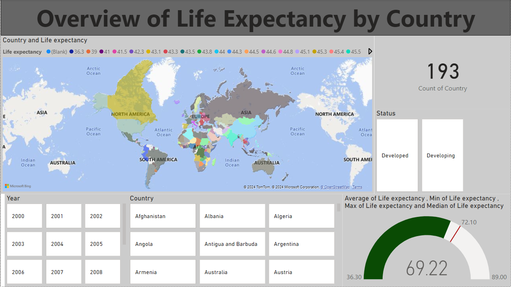
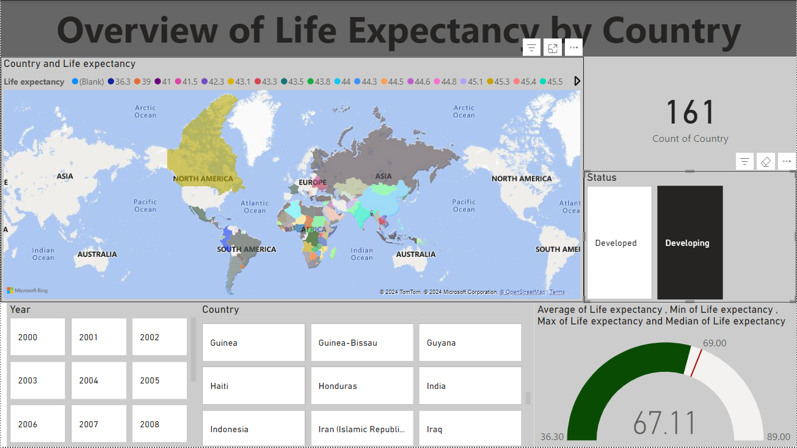
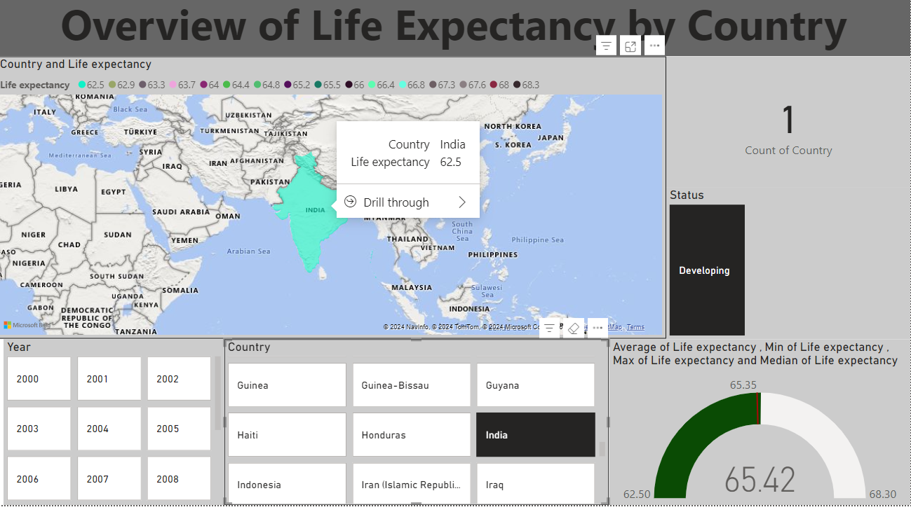

# Life Expectancy Analysis Dashboard Project

## Project Overview

This project involves creating a comprehensive Power BI report that visualizes global life expectancy trends and its relationships with various socio-economic and health factors. The report is structured into **10 interactive dashboards**, each providing insights into a different aspect of life expectancy using diverse datasets. The visualizations aim to explore and present key correlations, trends, and patterns across multiple dimensions such as health, education, economics, and demographics.

The dataset used in this project includes key variables like **Life Expectancy**, **GDP**, **Health Indicators**, **Education Levels**, and more, which will be analyzed to gain insights into the factors that influence life expectancy globally.

## Key Features

### Dashboards:
1. **Overview of Life Expectancy by Country**  
   - Global map visualizing life expectancy across countries.
   - Bar charts and line charts to show life expectancy trends over time.
   - Table for top 10 countries with the highest/lowest life expectancy.





2. **Life Expectancy vs. Economic Indicators**  
   - Scatter plot to show the relationship between Life Expectancy and GDP.
   - Analysis of Total Expenditure and its effect on Life Expectancy.

3. **Health Indicators and Life Expectancy**  
   - Scatter plots for the relationship between life expectancy and health indicators like adult mortality and infant deaths.
   - Visualization of vaccination rates and their correlation with life expectancy.

4. **BMI and Life Expectancy**  
   - Scatter plot of BMI vs. life expectancy.
   - Trend analysis of average BMI over time.

5. **Infant and Under-Five Mortality**  
   - Visualizations of infant mortality and under-five deaths by country.
   - Analysis of the relationship between mortality rates and life expectancy.

6. **Education and Life Expectancy**  
   - Scatter plot to show the impact of schooling years on life expectancy.
   - Trend analysis of education levels over time.


### Interactivity:
- **Filters and Slicers**: Each dashboard includes slicers for filtering data by **Country**, **Year**, **Region**, and other key metrics, allowing users to interactively explore the data.
- **Dynamic Visualizations**: Real-time filtering and zoomable maps and charts to enable in-depth exploration of specific data points and trends.

### Data Analysis:
- **Correlation Insights**: Identify relationships between variables such as GDP, adult mortality, schooling years, and life expectancy.
- **Trend Analysis**: Examine how life expectancy has changed over time and its relation to other factors such as healthcare, education, and economic status.

## Dataset Overview

The dataset used for this project contains the following key columns:
- **Country**: The name of the country.
- **Year**: The year of the data entry.
- **Life expectancy**: The average life expectancy for the specified country and year.
- **GDP**: Gross Domestic Product of the country.
- **Adult Mortality**: Mortality rate for adults.
- **Infant Deaths**: Number of infant deaths.
- **Total Expenditure**: Government expenditure on health.
- **BMI**: Body Mass Index (average).
- **Schooling**: Average years of schooling.
- **Vaccination rates**: Polio, Hepatitis B, and Diphtheria vaccination rates by country.

## Technologies Used
- **Power BI**: For data visualization and dashboard creation.
- **Dataset**: Global dataset containing life expectancy, health, economic, and demographic data.

## Installation and Usage

1. **Clone the repository**:
   ```bash
   git clone https://github.com/ksid10/powerbi_portfolio.git
